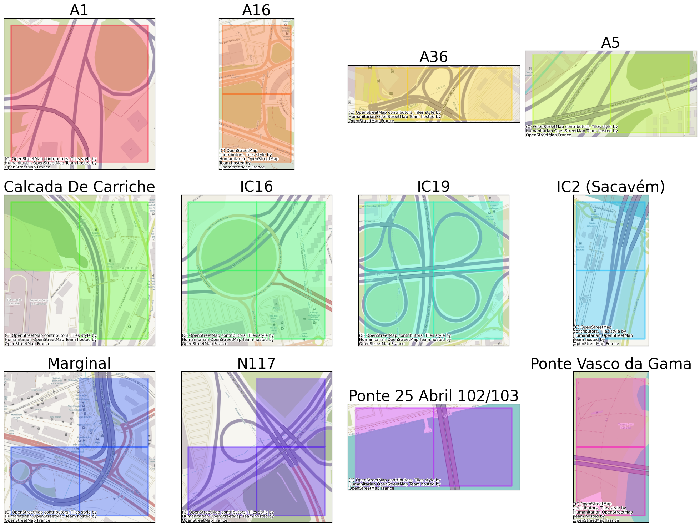

# Entrances used for detection

This image shows all the entrances taken into account for the project. It provides a visual representation of the different entry points considered in our analysis.

## Closer look at the intersections

## One of entarnces predictions

### Experimenting with LSTM model

Several experiments were conducted to evaluate the performance of an LSTM model in predicting time series data. The LSTM model was employed to predict consecutive values of the C1 parameter, representing the number of distinct terminals in the grid. To clean the dataset, irrelevant columns were removed. The C1 parameter was resampled to reflect the mean traffic in each hour and interpolated to address missing values. Also hour and day of the week were added as additional parameters. The data was then normalized to a range of 0-1.

Data transformation involved organizing it into sequences and labels suitable for LSTM training. Each sequence comprised 48 values, predicting one value. Subsequently, all sequences were divided into training and testing sets. The model underwent training and evaluation, wherein 6, 12 or 24 consecutive values were predicted from a sequence in the test set to assess model performance.

The results are depicted in a line plot, illustrating the predicted values, original data, the sequence used for prediction and predictions based on historic model. First plot for each group of strets presents period of three months, with time step equal one hour. This plot aids in gauging the accuracy of LSTM predictions. The zoomed plot presents only the most important part of the period (mainly the sequence used for prediciton and predictons itself). It can be used to compare results of two models more precisly.

### SOM traffic anomalies

### Distance Map
